<div align="center">

# 🤖 Agent-v

### *The Ultimate AI Skills Ecosystem — 1,200+ Production-Ready Skills for Autonomous Agents*


<br />


</div>

---

## ✨ Overview

> **Agent-v** is a comprehensive, modular skills library designed for building **autonomous AI agents** capable of complex reasoning, tool use, and real-world task execution. With **1,200+ production-ready skills** across **40+ categories**, Agent-v provides the building blocks for next-generation AI applications.

<div align="center">

| 🎯 **Purpose** | 🚀 **Scale** | 🔧 **Architecture** | 📦 **Distribution** |
|:---:|:---:|:---:|:---:|
| Autonomous Agent Skills | 1,200+ Skills | Modular & Composable | GitHub + npm + PyPI |

</div>

---

## 🎬 Live Demo

<div align="center">

### 🎥 Watch Agent-v in Action

[](https://www.youtube.com/watch?v=DEMO_VIDEO_ID)

*Click to watch the full demonstration*

</div>

---

## 🏗️ Architecture

```mermaid
graph TB
    subgraph "Agent Core"
        A[🤖 Agent Runtime] --> B[🧠 Reasoning Engine]
        A --> C[🔧 Tool Executor]
        A --> D[💾 Memory Manager]
    end
    
    subgraph "Skills Layer (.skills/)"
        E[📚 Skill Registry] --> F[🔍 Skill Discovery]
        F --> G[⚡ Skill Execution]
        G --> H[📊 Skill Analytics]
    end
    
    subgraph "Categories (40+)"
        I[🎨 Frontend & UI/UX]
        J[⚙️ Backend & APIs]
        K[🗄️ Databases & Storage]
        L[🤖 ML & AI Training]
        M[🔒 Security & Pentesting]
        N[☁️ Cloud & DevOps]
        O[📱 Mobile & Desktop]
        P[🎮 Game Development]
        Q[📊 Data Analytics]
        R[🌐 Networking & Comms]
    end
    
    A --> E
    E --> I & J & K & L & M & N & O & P & Q & R
    
    style A fill:#1a1a2e,stroke:#FFD700,stroke-width:2px
    style E fill:#16213e,stroke:#00D4FF,stroke-width:2px
    style I fill:#0f3460,stroke:#4ECDC4
    style J fill:#0f3460,stroke:#4ECDC4
    style K fill:#0f3460,stroke:#4ECDC4
    style L fill:#0f3460,stroke:#4ECDC4
    style M fill:#0f3460,stroke:#FF6B6B
    style N fill:#0f3460,stroke:#A855F7
    style O fill:#0f3460,stroke:#FFD700
    style P fill:#0f3460,stroke:#FF6B6B
    style Q fill:#0f3460,stroke:#00D4FF
    style R fill:#0f3460,stroke:#A855F7
```



---

## 📁 Repository Structure

```
Agent-v/
├── .skills/                          # 🎯 Core Skills Library (1,200+ skills)
│   ├── 3D-simulation/               # 🌍 3D physics, rendering, simulation
│   ├── agent-orchestration/         # 🤖 Multi-agent coordination
│   ├── ai-training-evaluation/      # 🧠 Model training & eval pipelines
│   ├── audio-music-speech/          # 🎵 TTS, STT, music generation
│   ├── backend-apis/                # ⚡ REST, GraphQL, gRPC, WebSocket
│   ├── browser-automation/          # 🌐 Playwright, Selenium, Puppeteer
│   ├── business-product/            # 📈 Product metrics, analytics
│   ├── cloud-platforms/             # ☁️ AWS, GCP, Azure, Kubernetes
│   ├── computer-vision/             # 👁️ CV models, OCR, detection
│   ├── data-analytics/              # 📊 ETL, visualization, BI
│   ├── databases-storage/           # 🗄️ SQL, NoSQL, vector DBs
│   ├── debugging-performance/       # 🔍 Profiling, tracing, optimization
│   ├── decision-making/             # 🎯 Planning, reasoning, RL
│   ├── devops-infrastructure/       # 🚀 CI/CD, IaC, monitoring
│   ├── documents-documentation/     # 📄 Docs generation, parsing
│   ├── edge-embedded/               # 📟 IoT, microcontrollers, RTOS
│   ├── education-career/            # 🎓 Learning paths, certifications
│   ├── finance-web3/                # 💰 DeFi, trading, blockchain
│   ├── frontend-web/                # 🎨 React, Vue, Svelte, Next.js
│   ├── game-development/            # 🎮 Unity, Unreal, Godot
│   ├── gpu-cuda/                    # ⚡ CUDA, OpenCL, GPU compute
│   ├── image-design/                # 🖼️ Generation, editing, design
│   ├── kali-tools/                  # 🛡️ Security tooling
│   ├── linux-systems/               # 🐧 System admin, scripting
│   ├── llm-rag-inference/           # 🧩 RAG, fine-tuning, serving
│   ├── marketing-seo/               # 📈 SEO, content, growth
│   ├── mcp-integrations/            # 🔌 Model Context Protocol
│   ├── memory-context/              # 🧠 Vector memory, context mgmt
│   ├── mobile-desktop/              # 📱 iOS, Android, Electron
│   ├── monitoring-observability/    # 📊 Logs, metrics, traces
│   ├── networking-comms/            # 🌐 Protocols, mesh, p2p
│   ├── productivity-collaboration/  # 🤝 Team tools, automation
│   ├── programming-architecture/    # 🏗️ Patterns, clean code
│   ├── research-science/            # 🔬 Scientific computing
│   ├── reverse-engineering-forensics/ # 🔍 Binary analysis, forensics
│   ├── robotics-physical-ai/        # 🤖 ROS, control, simulation
│   ├── sandbox-access-control/      # 🏖️ Secure execution envs
│   ├── scientific-computing/        # 🧮 NumPy, JAX, HPC
│   ├── security-pentesting/         # 🔐 Vuln scanning, exploits
│   ├── skill-management/            # 📦 Skill packaging, registry
│   ├── testing-quality/             # ✅ Unit, E2E, property testing
│   ├── ui-ux-accessibility/         # ♿ Design systems, a11y
│   ├── video-animation/             # 🎬 Video gen, editing, animation
│   ├── writing-content/             # ✍️ Copywriting, content gen
│   ├── xr-spatial/                  # 🕶️ AR/VR/MR, spatial computing
│   ├── _catalog/                    # 📋 Skill catalog & index
│   ├── AGENTS.md                    # 🤖 Agent configurations
│   ├── QUICK-INDEX.md               # ⚡ Quick skill lookup
│   └── catalog.html                 # 🌐 Interactive catalog
├── .github/
│   ├── workflows/                   # 🔄 CI/CD pipelines
│   ├── ISSUE_TEMPLATE/              # 🐛 Issue templates
│   └── assets/                      # 🎨 Images, banners
├── docs/                            # 📚 Documentation
├── examples/                        # 💡 Usage examples
├── scripts/                         # 🛠️ Utility scripts
├── CONTRIBUTING.md                  # 🤝 Contribution guide
├── LICENSE                          # ⚖️ MIT License
└── README.md                        # 📖 This file
```

---

## 🚀 Quick Start

### Prerequisites

- **Python 3.10+** or **Node.js 18+**
- **Git** for cloning
- **Docker** (optional, for sandboxed execution)

### Installation

```bash
# Clone the repository
git clone https://github.com/Manoj-11-Dahal/Agent-v.git
cd Agent-v

# Install Python dependencies
pip install -r requirements.txt

# Or install Node.js dependencies
npm install

# Verify installation
python -m agent_v --version
```

### Basic Usage

```python
from agent_v import Agent, SkillRegistry

# Initialize agent with skills
agent = Agent(
    skills_path=".skills",
    config="configs/default.yaml"
)

# Load specific skill categories
agent.load_skills([
    "frontend-web",
    "backend-apis", 
    "databases-storage",
    "testing-quality"
])

# Execute a task
result = await agent.execute("""
    Create a REST API with user authentication,
    write tests, and deploy to Kubernetes
""")

print(result)
```

```javascript
// JavaScript/TypeScript usage
import { Agent, SkillRegistry } from '@agent-v/core';

const agent = new Agent({
  skillsPath: '.skills',
  config: 'configs/default.yaml'
});

await agent.loadSkills([
  'frontend-web',
  'backend-apis',
  'video-animation'
]);

const result = await agent.execute(`
  Generate a product demo video with 
  animated UI components and deploy to Vercel
`);

console.log(result);
```

---

## 🎯 Featured Skill Categories

<div align="center">

| Category | Skills | Description | Status |
|:---:|:---:|:---|:---:|
| 🎨 **Frontend Web** | 80+ | React, Vue, Svelte, Next.js, Tailwind, Shadcn | ✅ Active |
| ⚙️ **Backend APIs** | 65+ | REST, GraphQL, gRPC, WebSockets, Auth | ✅ Active |
| 🤖 **LLM & RAG** | 95+ | Inference, fine-tuning, embeddings, agents | ✅ Active |
| 🔒 **Security Pentesting** | 120+ | Vuln scanning, exploits, red teaming | ✅ Active |
| 🎬 **Video Animation** | 150+ | GenAI video, editing, motion graphics | ✅ Active |
| ☁️ **Cloud & DevOps** | 85+ | K8s, Terraform, CI/CD, observability | ✅ Active |
| 🧠 **AI Training** | 70+ | Distributed training, eval, optimization | ✅ Active |
| 📊 **Data Analytics** | 60+ | ETL, BI, visualization, ML pipelines | ✅ Active |
| 🕶️ **XR Spatial** | 55+ | AR/VR, WebXR, spatial computing | ✅ Active |
| 🧪 **Testing Quality** | 110+ | Unit, E2E, property, chaos, visual | ✅ Active |

</div>

---

## 🎨 UI/UX Showcase

<div align="center">

### Interactive Skill Explorer

```html
<skill-explorer 
  categories="40" 
  skills="1200+" 
  theme="dark"
  animated="true"
  searchable="true"
/>
```

<details>
<summary>🎯 <strong>Click to see animated skill cards</strong></summary>

```tsx
// Animated Skill Card Component
<motion.div
  initial={{ opacity: 0, y: 20 }}
  animate={{ opacity: 1, y: 0 }}
  transition={{ duration: 0.4, delay: index * 0.05 }}
  whileHover={{ scale: 1.02, boxShadow: "0 20px 40px rgba(0,212,255,0.2)" }}
  className="skill-card"
>
  <motion.div 
    animate={{ rotate: [0, 2, -2, 0] }}
    transition={{ repeat: Infinity, duration: 3 }}
    className="skill-icon"
  >
    <Icon />
  </motion.div>
  <h3>{skill.name}</h3>
  <p>{skill.description}</p>
  <Badge>{skill.category}</Badge>
</motion.div>
```

</details>

</div>

---

## 📊 Statistics

<div align="center">


</div>

---

## 🤝 Contributing

We welcome contributions! Please see our [Contributing Guide](CONTRIBUTING.md) for details.

### How to Contribute

1. **Fork** the repository
2. **Create** a feature branch (`git checkout -b feature/amazing-skill`)
3. **Add** your skill following the [Skill Template](.skills/skill-template/)
4. **Test** your skill thoroughly
5. **Submit** a Pull Request

### Skill Contribution Checklist

- [ ] Skill follows the [Skill Specification](docs/skill-spec.md)
- [ ] Includes comprehensive tests
- [ ] Documentation with examples
- [ ] No breaking changes to existing skills
- [ ] Passes CI/CD pipeline

---

## 📜 License

This project is licensed under the **MIT License** - see the [LICENSE](LICENSE) file for details.

```
MIT License

Copyright (c) 2026 Manoj-11-Dahal

Permission is hereby granted, free of charge, to any person obtaining a copy
of this software and associated documentation files (the "Software"), to deal
in the Software without restriction, including without limitation the rights
to use, copy, modify, merge, publish, distribute, sublicense, and/or sell
copies of the Software, and to permit persons to whom the Software is
furnished to do so, subject to the following conditions:

The above copyright notice and this permission notice shall be included in all
copies or substantial portions of the Software.
```

---

## 🙏 Acknowledgments

<div align="center">

| Project | Description | Link |
|:---|:---|:---|
| **LangChain** | LLM application framework | [GitHub](https://github.com/langchain-ai/langchain) |
| **AutoGPT** | Autonomous GPT-4 agent | [GitHub](https://github.com/Significant-Gravitas/AutoGPT) |
| **LangGraph** | Stateful multi-actor apps | [GitHub](https://github.com/langchain-ai/langgraph) |
| **CrewAI** | Role-playing AI agents | [GitHub](https://github.com/joaomdmoura/crewAI) |
| **Semantic Kernel** | Microsoft's AI orchestrator | [GitHub](https://github.com/microsoft/semantic-kernel) |

</div>

---

## 📞 Support & Community

<div align="center">

[](https://discord.gg/agent-v)
[](https://twitter.com/agent_v_ai)
[](https://github.com/Manoj-11-Dahal/Agent-v/discussions)
[](mailto:hackoffice88@gmail.com)

</div>

---

## 🗺️ Roadmap

<div align="center">

| Quarter | Milestone | Status |
|:---:|:---|:---:|
| Q3 2026 | 1,200+ Skills Released | ✅ **Complete** |
| Q4 2026 | Skill Marketplace Launch | 🚧 **In Progress** |
| Q1 2027 | Visual Skill Builder UI | 📋 **Planned** |
| Q2 2027 | Enterprise Features | 📋 **Planned** |
| Q3 2027 | Agent-v Cloud Platform | 📋 **Planned** |

</div>

---

<div align="center">

### ⭐ Star this repo if you find it useful!

<a href="https://github.com/Manoj-11-Dahal/Agent-v/stargazers">
  
</a>

<br /><br />

**Built with ❤️ by [Manoj-11-Dahal](https://github.com/Manoj-11-Dahal) and contributors**

[🔝 Back to Top](#-agent-v)

</div>

---

<details>
<summary>📝 <strong>Changelog</strong></summary>

### v2.0.0 (2026-09-26)
- 🎉 Initial release with 1,200+ skills
- 📁 Organized into 40+ categories
- 📋 Added interactive catalog (catalog.html)
- 🤖 Agent configurations (AGENTS.md)
- ⚡ Quick index for fast lookup (QUICK-INDEX.md)

### v1.0.0 (2026-07-14)
- 🌱 Project initialization
- 📦 Core skill framework established

</details>